# Architecture Exploration — PawPets E-commerce

**Date**: 2026-06-19  
**Status**: Complete  
**PRD Reference**: Full PRD (14 MVP tasks, 4 post-MVP tasks)  
**Stack**: Next.js 14+ App Router | TypeScript | Tailwind CSS | PostgreSQL + Prisma | NextAuth.js | Zustand | Simulated Payment

---

## A. Module Breakdown — Vertical Slices

The architecture follows a **vertical slice** pattern: each module owns its pages, components, API routes, and database concerns. Modules depend on the **Core/Shared layer** and on each other only through well-defined interfaces.

### 1. Core / Shared Layer (Foundation — Medium complexity)

| What | Files / Structure | Purpose |
|------|------------------|---------|
| **Prisma client** | `lib/prisma.ts` | Singleton DB client |
| **Shared types** | `types/index.ts`, `types/next-auth.d.ts` | Domain types, Prisma-generated types, Auth type extensions |
| **UI primitives** | `components/ui/Button.tsx`, `Card.tsx`, `Input.tsx`, `Badge.tsx`, `Modal.tsx`, `Spinner.tsx` | Atomic design primitives shared across all features |
| **Layout** | `components/layout/Header.tsx`, `Footer.tsx`, `MainNav.tsx`, `MobileMenu.tsx` | App shell — navbar, footer, navigation |
| **Lib utilities** | `lib/utils.ts` (cn(), formatters), `lib/constants.ts` | Tailwind merge, price formatting, route constants |
| **Zustand stores** | `stores/cart-store.ts`, `stores/ui-store.ts` | Global state (cart, UI preferences) |
| **Auth config** | `lib/auth.ts` | NextAuth.js configuration, callbacks, providers, adapter |

**Dependencies**: None (foundation)  
**Build order**: **1st** — everything depends on it

### 2. Catalog & Products Module (Large — the public face)

| What | Files | Purpose |
|------|-------|---------|
| **Pages** | `app/(store)/page.tsx` (home), `app/(store)/products/page.tsx` (listing), `app/(store)/products/[slug]/page.tsx` (detail), `app/(store)/categories/[slug]/page.tsx` | SSR product listing + detail |
| **Components** | `components/products/ProductCard.tsx`, `ProductGrid.tsx`, `ProductFilters.tsx`, `ProductGallery.tsx`, `SearchBar.tsx`, `Pagination.tsx`, `Breadcrumbs.tsx` | Catalog UI |
| **API routes** | `app/api/products/route.ts` (GET list with filters), `app/api/products/[slug]/route.ts` (GET detail), `app/api/categories/route.ts` | Public product data |
| **DB models** | Product, Category, Subcategory, ProductImage, ProductTag | Schema ownership |

**Dependencies**: Core/Shared  
**Build order**: **2nd** (first vertical slice — visible value immediately)

### 3. Auth Module (Medium — cross-cutting concern)

| What | Files | Purpose |
|------|-------|---------|
| **Pages** | `app/(auth)/login/page.tsx`, `app/(auth)/register/page.tsx`, `app/(auth)/error/page.tsx` | Auth pages |
| **Components** | `components/auth/LoginForm.tsx`, `RegisterForm.tsx`, `AuthGuard.tsx` (wrapper) | Auth forms, route protection |
| **Config** | `lib/auth.ts` | NextAuth config with credentials + optional OAuth, Prisma adapter, role-based JWT callback |
| **API routes** | `app/api/auth/[...nextauth]/route.ts` | NextAuth catch-all |
| **DB models** | User, Account, Session, VerificationToken | Schema (Prisma adapter schema) |

**Dependencies**: Core/Shared, DB schema (User model)  
**Build order**: **3rd** (blocks checkout, orders, admin)  
**Important**: Auth doesn't block Catalog or Cart — those work without login.

### 4. Cart Module (Medium — client-state heavy)

| What | Files | Purpose |
|------|-------|---------|
| **Pages** | `app/(store)/cart/page.tsx` | Cart page |
| **Components** | `components/cart/CartItem.tsx`, `CartSummary.tsx`, `CartIcon.tsx` (navbar), `EmptyCart.tsx` | Cart UI + navbar indicator |
| **Store** | `stores/cart-store.ts` | Zustand store with localStorage persistence |
| **API routes** | `app/api/cart/route.ts` (optional server sync for logged-in users) | Cross-session persistence |

**Dependencies**: Core/Shared, Products (product data for cart items)  
**Build order**: **4th** (needs products to add to cart)  
**Note**: Cart state is client-side via Zustand + localStorage. Server sync is optional post-MVP.

### 5. Checkout & Orders Module (Large — the critical path)

| What | Files | Purpose |
|------|-------|---------|
| **Pages** | `app/(store)/checkout/page.tsx` (multi-step: shipping → review → payment), `app/(store)/orders/page.tsx`, `app/(store)/orders/[id]/page.tsx` | Checkout flow, order history, order detail |
| **Components** | `components/checkout/ShippingForm.tsx`, `PaymentSimulation.tsx`, `OrderReview.tsx`, `OrderConfirmed.tsx`, `components/orders/OrderCard.tsx`, `OrderDetail.tsx` | Checkout steps, order display |
| **API routes** | `app/api/checkout/route.ts` (POST — create order, payment simulation), `app/api/orders/route.ts` (GET), `app/api/orders/[id]/route.ts` (GET) | Order creation and retrieval |
| **DB models** | Order, OrderItem, ShippingAddress | Schema ownership |

**Dependencies**: Core/Shared, Cart (reads cart to create order), Auth (requires authenticated user)  
**Build order**: **5th**

### 6. User Profile Module (Small)

| What | Files | Purpose |
|------|-------|---------|
| **Pages** | `app/(store)/profile/page.tsx`, `app/(store)/profile/orders/page.tsx` | Profile view/edit, order history |
| **Components** | `components/profile/ProfileForm.tsx`, `OrderHistoryList.tsx` | Profile edit, order list |
| **API routes** | `app/api/user/profile/route.ts` (GET/PUT) | User data |

**Dependencies**: Core/Shared, Auth, Orders (reads order data)  
**Build order**: **6th** (after checkout works)

### 7. Admin Dashboard Module (Large — internal tool)

| What | Files | Purpose |
|------|-------|---------|
| **Layout** | `app/admin/layout.tsx` | Admin layout with sidebar navigation |
| **Pages** | `app/admin/page.tsx` (dashboard home), `app/admin/products/page.tsx` (list), `app/admin/products/new/page.tsx`, `app/admin/products/[id]/edit/page.tsx`, `app/admin/orders/page.tsx`, `app/admin/stock/page.tsx` | Admin CRUD |
| **Components** | `components/admin/Sidebar.tsx`, `DataTable.tsx`, `ProductForm.tsx`, `OrderStatusSelect.tsx`, `ImageUploader.tsx`, `StatsCard.tsx` | Admin UI toolkit |
| **API routes** | `app/api/admin/products/route.ts` (GET/POST), `app/api/admin/products/[id]/route.ts` (PUT/DELETE), `app/api/admin/orders/route.ts` (GET), `app/api/admin/orders/[id]/route.ts` (PATCH), `app/api/admin/stock/route.ts` (PATCH) | Admin CRUD endpoints |
| **DB models** | Reuses Product, Order, OrderItem, Category | Schema ownership shared with Catalog |

**Dependencies**: Core/Shared, Auth (admin role guard), Products (CRUD), Orders (management)  
**Build order**: **7th** (last MVP module — admin manages what already exists)  
**Sub-modules**:
- MVP: Product CRUD, Order management, Stock management
- Phase 2: Offers/Discounts, Stats dashboard, Email banner, PDF invoices

---

## B. Architecture Diagram

```mermaid
flowchart TD
    subgraph Client["Client Browser (Next.js App Router)"]
        direction TB
        Shared["Shared UI Layer\n(Button, Card, Input, Badge, Modal)"]
        Layout["App Shell\n(Header, Footer, Nav, MobileMenu)"]
        
        subgraph Features["Feature Pages"]
            Catalog["Catalog & Products\n/products, /categories/[slug]"]
            Cart["Cart\n/cart"]
            AuthPages["Auth\n/login, /register"]
            Checkout["Checkout & Orders\n/checkout, /orders"]
            Profile["Profile\n/profile"]
        end
        
        subgraph Admin["Admin Module"]
            AdminLayout["Admin Layout\n/Sidebar"]
            AdminProducts["Product CRUD\n/admin/products"]
            AdminOrders["Order Mgmt\n/admin/orders"]
            AdminStock["Stock Mgmt\n/admin/stock"]
        end
        
        Stores["Zustand Stores\n(cart, ui)"]
        Features --> Shared
        Features --> Layout
        Features --> Stores
        Admin --> Shared
        Admin --> AdminLayout
    end

    subgraph API["Next.js API Layer (/api/*)"]
        direction TB
        AuthAPI["Auth\n[...nextauth]"]
        ProductsAPI["Products\nGET /products"]
        CartAPI["Cart\nPOST /cart"]
        CheckoutAPI["Checkout\nPOST /checkout"]
        OrdersAPI["Orders\nGET /orders"]
        AdminAPI["Admin\nCRUD products & orders"]
    end

    subgraph DB["Data Layer"]
        Prisma["Prisma ORM\n(Singleton Client)"]
        PG[("PostgreSQL\nDatabase")]
    end

    %% Client → API flows
    Catalog --> ProductsAPI
    Cart --> CartAPI
    Cart --> ProductsAPI
    Checkout --> CheckoutAPI
    Checkout --> AuthAPI
    Checkout --> OrdersAPI
    Profile --> OrdersAPI
    Admin --> AdminAPI

    %% Auth boundaries
    AuthPages --> AuthAPI
    Checkout -.->|requires auth| AuthAPI
    Profile -.->|requires auth| AuthAPI
    Admin -.->|requires admin role| AuthAPI

    %% API → DB
    ProductsAPI --> Prisma
    CartAPI --> Prisma
    CheckoutAPI --> Prisma
    OrdersAPI --> Prisma
    AdminAPI --> Prisma
    AuthAPI --> Prisma
    Prisma --> PG

    %% Styles
    classDef public fill:#1573B6,color:#fff
    classDef auth fill:#E28A37,color:#fff
    classDef admin fill:#57C2D1,color:#1F2937
    classDef shared fill:#e2e8f0,color:#1F2937
    
    class Catalog,Cart,ProductsAPI,CartAPI public
    class Checkout,Profile,CheckoutAPI,OrdersAPI,AuthPages,AuthAPI auth
    class Admin,AdminProducts,AdminOrders,AdminStock,AdminAPI admin
    class Shared,Layout,Stores,Prisma,PG shared
```



### Auth Boundaries

| Route | Access | Guard Mechanism |
|-------|--------|----------------|
| `/products/*`, `/cart` | Public | None |
| `/checkout/*` | Authenticated only | `AuthGuard` wrapper or middleware |
| `/orders/*` | Authenticated only | `AuthGuard` wrapper |
| `/profile/*` | Authenticated only | `AuthGuard` wrapper |
| `/admin/*` | Admin role only | Middleware + JWT role check + API guard |
| `/api/admin/*` | Admin role only | `getServerSession` + role check in each route |

### Data Flow Pattern (for every feature)

```
Browser (page load)
  → Next.js SSR (fetch data in server component via Prisma directly)
  → HTML rendered server-side
  → Client hydration + Zustand store restoration

User Action (add to cart, filter, etc.)
  → Client component state / Zustand (instant feedback)
  → Optionally: API call (POST/PUT/DELETE) → Prisma → DB
  → Revalidate or refetch
```

For listing pages: use **server components** with search params for filters.
For interactive features (cart, checkout forms): use **client components** with Zustand.

---

## C. Recommended Build Strategy

### Approach: Hybrid — Database-first for schema, then vertical-slice for features

**Why hybrid**: Database schema must exist before features can query, but going "full schema first" means 2-3 sessions of pure DB work before seeing any UI. Instead:

1. **Define the full schema up front** (one session) — this avoids painful migrations later.
2. **Build one complete vertical slice** (Catalog: DB → API → UI) — establishes the pattern.
3. **Add features horizontally** — each feature follows the same DB→API→UI pattern.

### Build Order with Value Delivery

```
Session 1: Scaffold + Schema (value: project runs, DB is ready)
Session 2: Core UI + Catalog browse (value: you see products on screen)
Session 3: Product detail + search + filters (value: full product experience)
Session 4: Cart (value: you can add/persist items)
Session 5: Auth (value: users can register/login)
Session 6: Checkout + Orders (value: full purchase flow works)
Session 7: Admin CRUD (value: admin can manage products)
Session 8: Admin orders + stock (value: admin can fulfill orders)
Session 9: Polish + responsive + edge cases
```

### First Working Vertical Slice — "Catalog Browsing"

The smallest slice that delivers visible value:

```
Prisma schema (Product + Category)
  → Seed script (5-10 products in 1-2 categories)
    → API: GET /api/products (basic listing)
      → Server component: ProductGrid with ProductCard
        → Page: /products renders products from DB
```

This proves: DB connects, API works, SSR renders, Tailwind styles, components compose.

---

## D. Risks and Considerations

### 1. Database Schema Dependencies

```
Category ──→ Product ──→ OrderItem
                │
                ├──→ ProductImage
                ├──→ ProductTag
                │
User ──→ Order ──→ OrderItem
                │
                └──→ ShippingAddress
```

**Risk**: OrderItem depends on both Product and Order, which depends on User. You CANNOT build Orders before Users and Products exist.  
**Mitigation**: Define ALL models in the first schema session. Relationships are locked in early; features consume them later.

### 2. Auth — The "Blocks Everything" Myth

**Reality**: Auth does NOT block:
- Catalog browsing (public)
- Cart (client-side, no auth needed)
- Product detail/search/filters (public)

Auth DOES block:
- Checkout (must know who the user is)
- Order history (must know whose orders)
- Admin dashboard (must verify role)

**Strategy**: Implement auth early (session 3-4) but not first. Catalog is buildable without it.

### 3. NextAuth.js Traps

- **Database adapter schema** must match Prisma schema exactly. Use the official `@auth/prisma-adapter` but beware: it defines its own models (User, Account, Session, VerificationToken) that overlap with your User model. You must extend, not duplicate.
- **Role-based auth**: NextAuth's default JWT doesn't include roles. Must add `role` to the JWT callback and session callback.
- **Credentials provider vs OAuth**: Credentials is simpler for this project but means managing password hashing (bcrypt). OAuth adds complexity. Start with credentials + email/password only.

**Mitigation**: Use the official `@auth/prisma-adapter` + custom `role` field on the User model. Add role to JWT + session in callbacks.

### 4. State Management — Zustand vs Context

| Concern | Zustand | Context |
|---------|---------|---------|
| Cart persistence | ✅ Built-in middleware (persist) | ❌ Manual localStorage sync |
| Performance | ✅ Selector-based re-renders | ❌ Re-renders all consumers |
| Bundle size | ~1KB | 0 (built-in) |
| Learning curve | Minimal (hooks-based) | Minimal |
| DevTools | ✅ Redux DevTools support | ❌ Limited |

**Decision**: **Zustand for cart** (needs persistence, frequent updates). Context for auth session (only changes on login/logout, simple to use with NextAuth's `SessionProvider`).

### 5. Testing Strategy Per Module

**Current state** (from openspec config): No test runner detected, strict_tdd: false.

| Module | Recommended Approach | When |
|--------|---------------------|------|
| Core/Shared | Visual review + manual QA | Each session |
| Catalog | Manual testing via browser (visible output) | Each session |
| Cart | Manual testing (add/remove/persist on refresh) | Cart session |
| Auth | Manual testing (login flow, protected routes redirect) | Auth session |
| Checkout | Manual E2E walkthrough | Checkout session |
| Admin | Manual testing (CRUD operations) | Admin session |

**Post-MVP**: Add Playwright or Cypress for E2E on critical paths (catalog browse → add to cart → checkout). Add Vitest for unit tests on utility functions and Zustand stores.

### 6. Estimated Module Complexity

| Module | Files | Est. Lines | Complexity | Risk |
|--------|-------|-----------|------------|------|
| Core/Shared | ~15-20 | ~400-600 | Medium | Low (no business logic) |
| Catalog | ~10-15 | ~500-800 | Large | Medium (filters are tricky) |
| Auth | ~8-10 | ~300-500 | Medium | High (NextAuth config fragile) |
| Cart | ~6-8 | ~200-400 | Medium | Low |
| Checkout/Orders | ~10-15 | ~500-800 | Large | High (critical path, edge cases) |
| Profile | ~4-6 | ~150-250 | Small | Low |
| Admin MVP | ~15-20 | ~600-1000 | Large | Medium (CRUD boilerplate) |
| **Total MVP** | **~70-95** | **~2600-4300** | | |

### 7. Delivery Strategy

Given the ~2600-4300 line estimate for MVP, this will **exceed** the 400-line PR budget per the Review Workload Guard. Each build session should produce one standalone PR:

| PR # | Change | Est. Lines | Independent? |
|------|--------|-----------|--------------|
| 1 | Scaffold + Schema + Seed | ~300 | ✅ Yes |
| 2 | Core UI + Catalog | ~500 | ✅ Yes (after PR1) |
| 3 | Auth | ~400 | ✅ Yes (after PR1) |
| 4 | Cart | ~300 | ✅ Yes (after PR2) |
| 5 | Checkout + Orders | ~600 | ❌ Depends on PR3+PR4 |
| 6 | Admin MVP | ~700 | ❌ Depends on PR3 |
| 7 | Polish + Responsive | ~300 | ✅ Yes (after PR5) |

Each PR stays under or near the 400-line budget except Admin MVP (which could be split into Product CRUD PR + Orders/Stock PR).

---

## E. Concrete Next Step

### First Change: `scaffold-and-schema`

**Goal**: Set up the entire project foundation so that every subsequent feature can focus on business logic, not configuration.

**Scope**:
1. Initialize Next.js 14+ with TypeScript + Tailwind CSS + `next/font` (Nunito)
2. Set up Prisma with PostgreSQL connection and full schema (all MVP models)
3. Create Prisma seed script (admin user, categories)
4. Set up project folder structure following the vertical slice pattern
5. Configure ESLint + Prettier (flat config)
6. Configure NextAuth.js scaffold (Prisma adapter, JWT with role, placeholder pages)
7. Build Core/Shared layer: Tailwind theme (brand colors), UI primitives (Button, Card, Badge), layout shell (Header, Footer)
8. Verify: `npm run build` succeeds, seed runs, `/` renders the shell

**Deliverables**: A working Next.js app with DB connected, brand styled, and ready for the Catalog PR.

**Recommended SDD pipeline**: `sdd-propose` → `sdd-spec` → `sdd-design` → `sdd-tasks` → `sdd-apply` → `sdd-verify`

---

## Architecture Decisions (to be formalized in design phase)

| Decision | Recommended Choice | Rationale |
|----------|-------------------|-----------|
| **App Layout** | Route groups: `(store)` for public, `(auth)` for auth pages, `admin` for admin | Clean URL structure, separate layouts |
| **Server vs Client** | Pages = server components; interactive elements = client components | SSR for SEO, minimal JS client-side |
| **Database queries** | Prisma direct in server components (no API for reads) | Skip HTTP hop for server-rendered pages |
| **API routes** | Only for mutations (POST/PUT/DELETE) | Keeps reads efficient, mutations centralized |
| **Cart** | Zustand + `persist` middleware (localStorage) | Instant UI, survives page refresh, simple |
| **Auth session** | NextAuth `SessionProvider` (React Context) | Only changes at login/logout, not performance-sensitive |
| **Admin guard** | Next.js middleware (matcher: `/admin/:path*`) + session check in layout | Double protection, no extra component needed |
| **Images** | Next.js built-in `Image` component, local `/public/images/` or external URL | Optimized, responsive, lazy loading |
| **CSS architecture** | Tailwind + `cn()` helper + Tailwind `extend` for brand tokens | No CSS modules needed for this scale |
